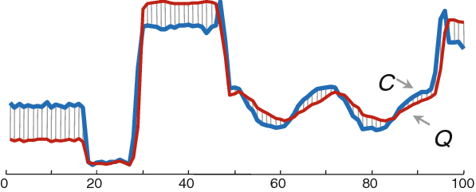
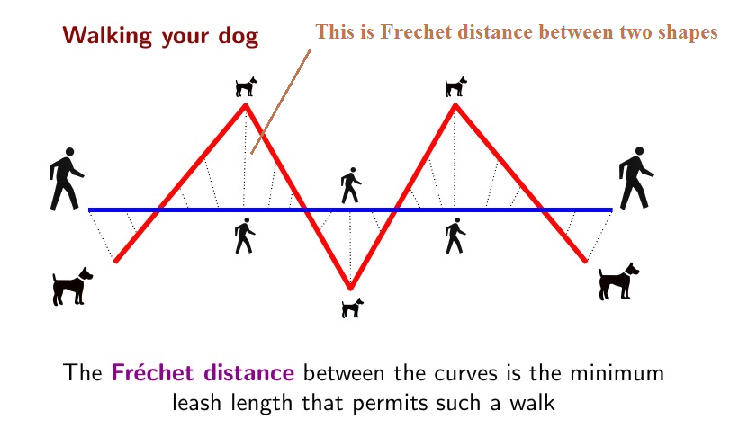
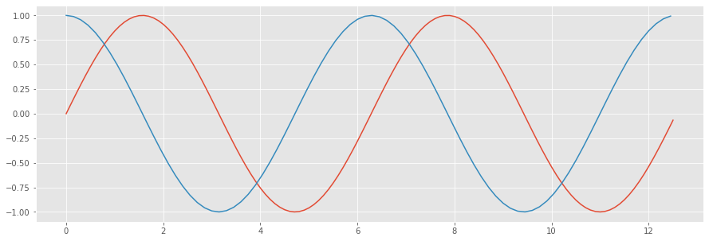
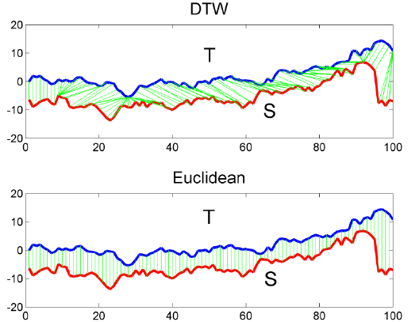

# Pinpointing

## Motivation

Given a node in a DAG and a query $t_0, t_1, t_2...t_n$, we want to know if a similar query appears *upstream* in the sewage graph. We look upstream at the nodes feeding into the given node and compare their past sensor data, adjusted backwards in time (the edges of the graph are weighted by the travel time in minutes between nodes).

## Background: Measurement

There are various ways to measure distance between two vectors. The naive way is Euclidean distance: the length of the straight line between each pair of points.



Another method is the *Fréchet distance*: the length of the shortest straight line that would allow both points to be traversed by two connected agents. (The common example is &ldquo;the length of the leash that would let a person walk a dog&rdquo;.)



But what if your curves are not exactly aligned? Sometimes the two appear very similar, but are out of phase, or offset in time.



To solve this we use a method called **Dynamic Time Warping** (DTW). It allows flexible matching of points along the two curves, to allow for their being close matches which are not aligned one-to-one.



## Finding paths

We iterate recursively over all the child nodes in the grid. At each point, we consider its sensor which are present in the query, and calculate the (z-normalised) DTW distance. A threshold is used to decide relevance (0.06 is the default). 

If a node has no sensors whose distance is below the threshold, we consider it a dead end and stop looking.

If it is missing data, we consider it a possible match and keep looking above it. (If it has nothing further down with data, we will discard it.)

If it has at least one sensor with data, we include it and store its distances.

## Scores

The distances which are below the threshold are first weighted based on sensor type (this can increase the distance to be greater than the threshold). The distance is converted to a percentage of confidence with the formula: $ \frac{threshold - distance}{threshold}$

## Chains

Ultimately a chain has the following structure:

```python
[
  ROOT,
  NODE_1: {
    EC: 81%,
    PH: 12%
  },
  NODE_2: none,
  NODE_3: {
    PI: 46%,
    TEMPERATURE: 12%,
    ORP: 6%
  }
]
```

To get the score for a chain, we can take the mean of each node's max confidence level. 

## Open questions

- If we are given an "event parameter" (e.g. this is an EC event), we can weight that parameter as being worth more. But are we still interested if we only find matches on other sensors?
- Should we just return one match, or several? Or should we have a confidence level above which we will return a match as definitely correct?